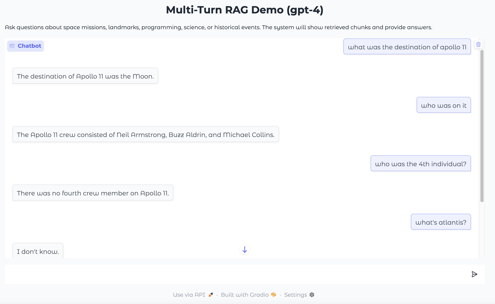
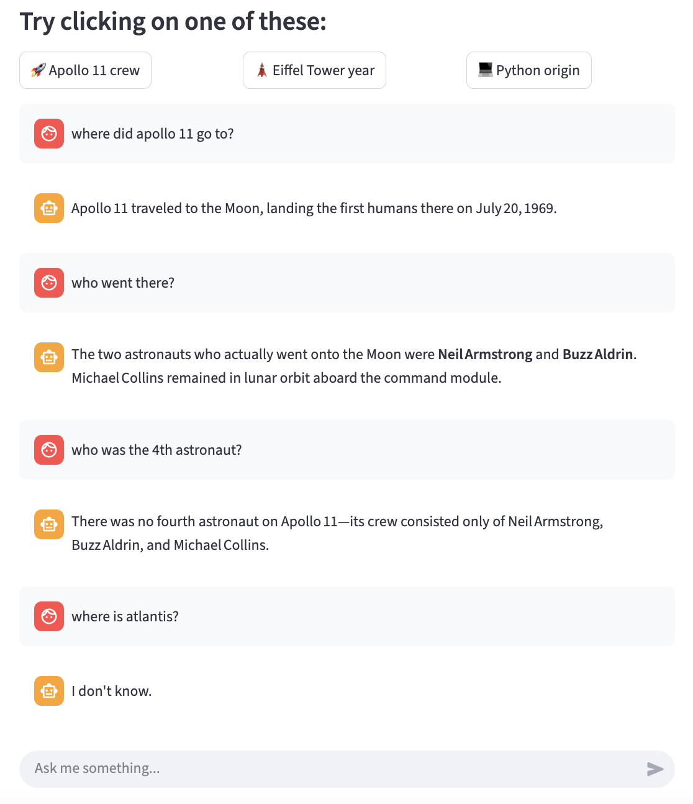
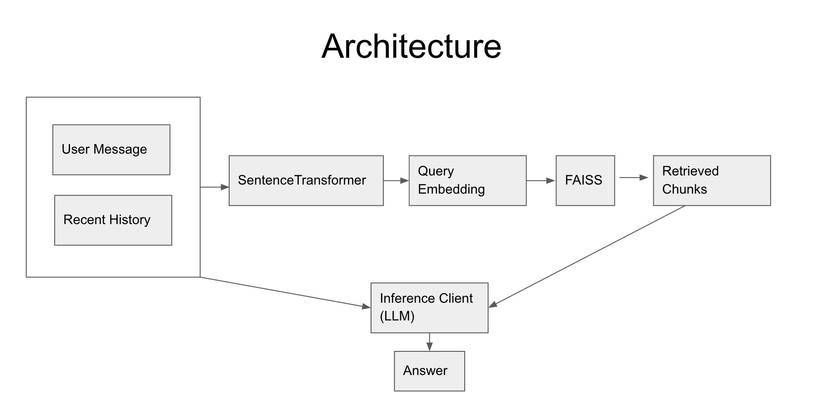

# Multi-Turn RAG Chatbot

A **Retrieval-Augmented Generation (RAG)** chatbot (conversational AI) that answers questions based on a curated set of documents. Combines **FAISS semantic search**, **SentenceTransformer embeddings**, and **OpenAI GPT-4** to provide context-aware responses for multi-turn conversations.
## Gradio chat UI


## Streamlit chat UI


## Quick Start

You can interact with the chatbot using one of the following options:

### Option 1: Chat with the deployed chatbot online
👉[Launch the chatbot](https://cp-rag-llm.streamlit.app/)

### Option 2: Run in Google Colab (no setup required)
[Open in Google Colab](https://colab.research.google.com/drive/1aetVpiI01FlGcQmJQE32crX949Ft0qi0?usp=sharing)

### Option 3: Run locally from this repository
1. Clone the repository:

```bash
git clone https://github.com/christophpang6/RAG_LLM_chatbot_demo
cd RAG_LLM_chatbot_demo
```

2. Ensure dependencies are installed:

```python
!pip install -q sentence-transformers faiss-cpu torch datasets evaluate rouge-score openai gradio
```
3. Set your OpenAI API key:

```python
import os
os.environ["OPENAI_API_KEY"] = "your-api-key-here"
```


---

## Features

- **RAG Retrieval System**  
  - Semantic search over a custom corpus using **FAISS**.  
  - Retrieves top-k relevant document chunks for any user query.  
  - Considers last 3 conversation turns for multi-turn context.

- **Context-Aware Chat with GPT-4**  
  - Generates answers strictly based on retrieved content.  
  - Responds “I don’t know” if the context lacks an answer.  

- **Custom Embeddings**  
  - Uses **SentenceTransformer (`all-MiniLM-L6-v2`)** for high-quality text embeddings.  
  - Supports diverse topics: space missions, programming, science, history, architecture.  

- **Interactive Gradio Interface**  
  - User-friendly chat interface with adjustable chatbox height.  
  - Preloaded example queries for quick testing.  
  - Supports sharing via Gradio links.  

- **Extensible & Modular**  
  - Easy to add new documents to the knowledge base.  
  - Retrieval, embedding, and chat components are modular.  

- **Debugging & Transparency**  
  - Optional verbose mode shows retrieved chunks and L2 distance scores. See example_chat_debugging_retrieval.txt for an example

---




## Tech Stack

- Python  
- **OpenAI API (GPT-4)**  
- **Gradio/Streamlit** for interactive UI deployment
- **FAISS** for fast similarity search  
- **Hugging Face SentenceTransformers** for embeddings  

---


## Extending the Knowledge Base

1. Add new documents to the `enhanced_sample_texts` dictionary.  
2. Each document should have a title and content.  
3. The system will automatically embed and index the new content on startup.  


## Skills Demonstrated

- Multi-turn conversation management  
- RAG architecture design to reduce hallucinations (will return "I don't know" instead)
- Embedding-based semantic search  
- Building and deploying interactive applications with Gradio/Streamlit
- Integration of OpenAI GPT-4 API  
- Modular and extensible Python code  
